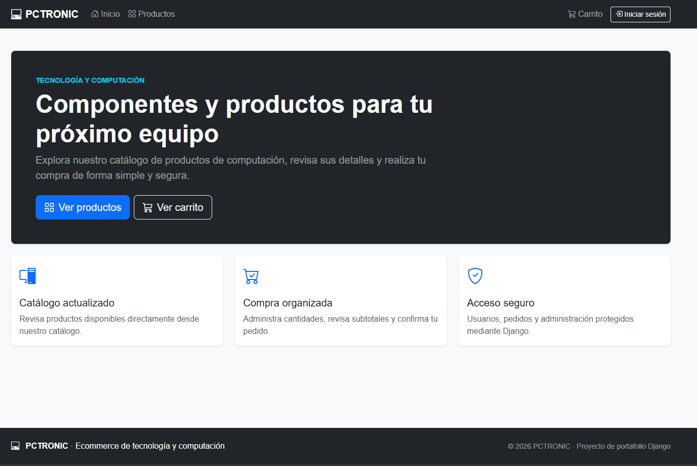
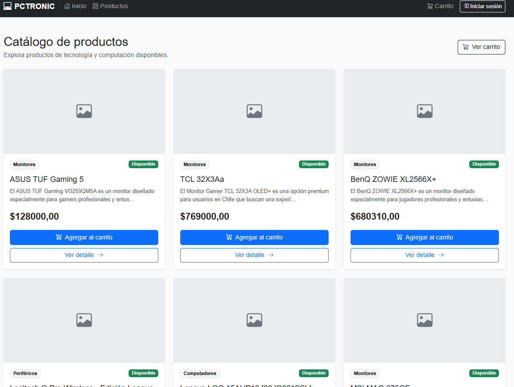
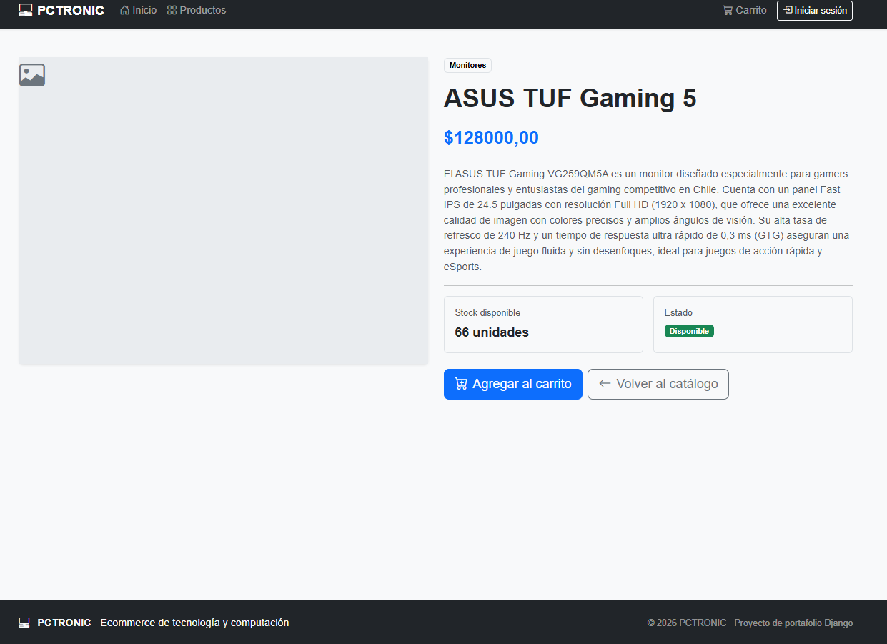
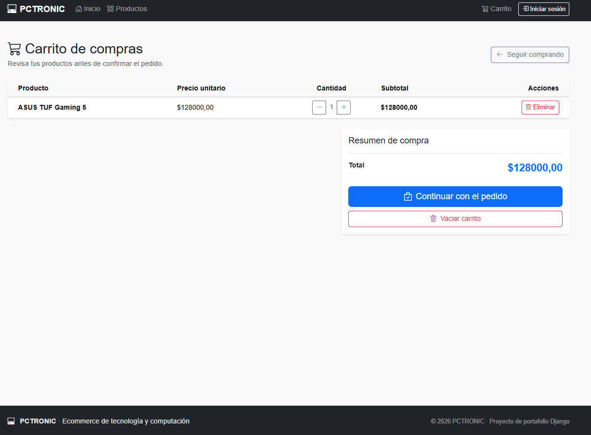
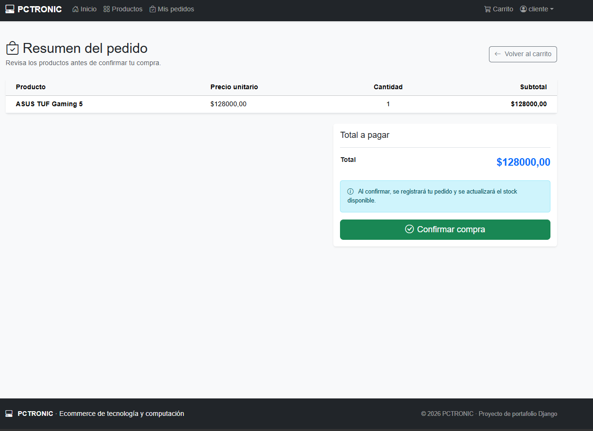
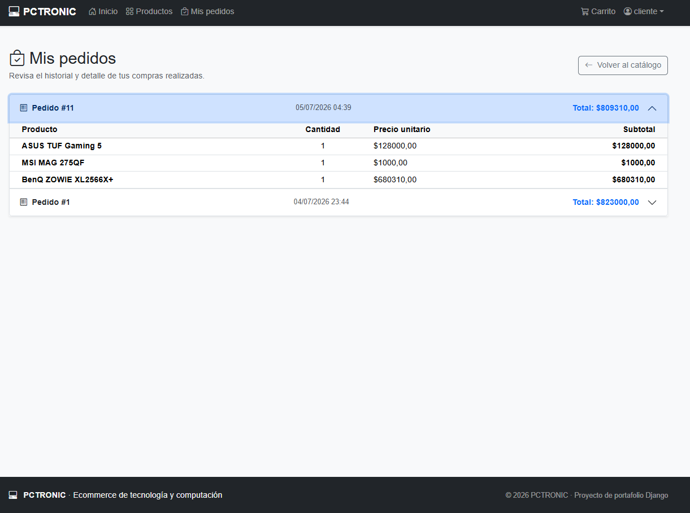
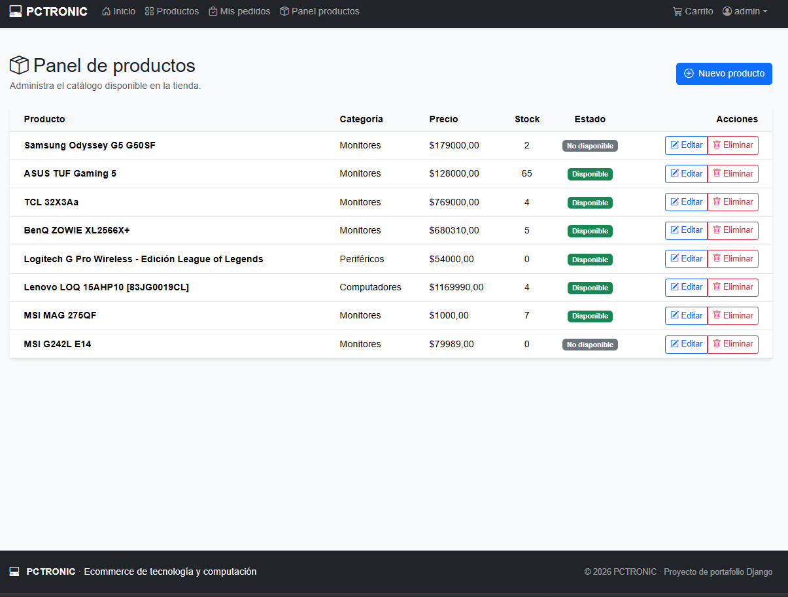
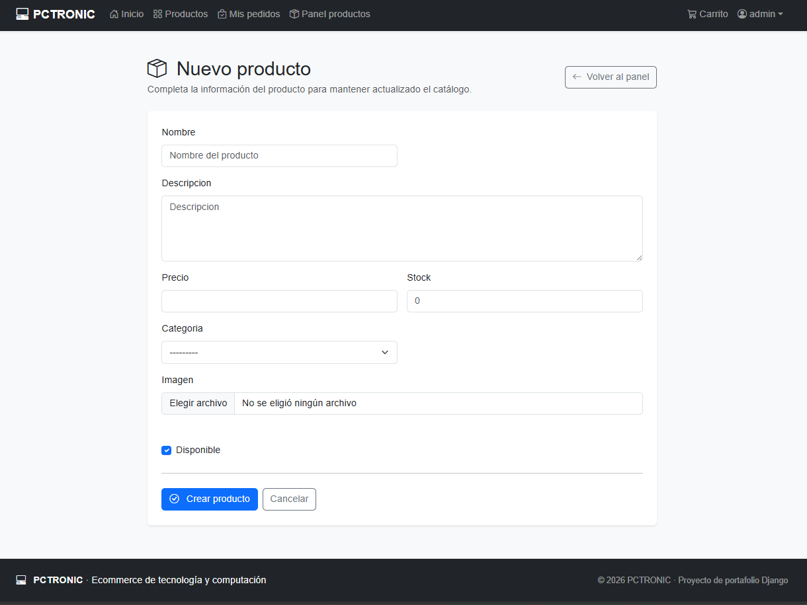
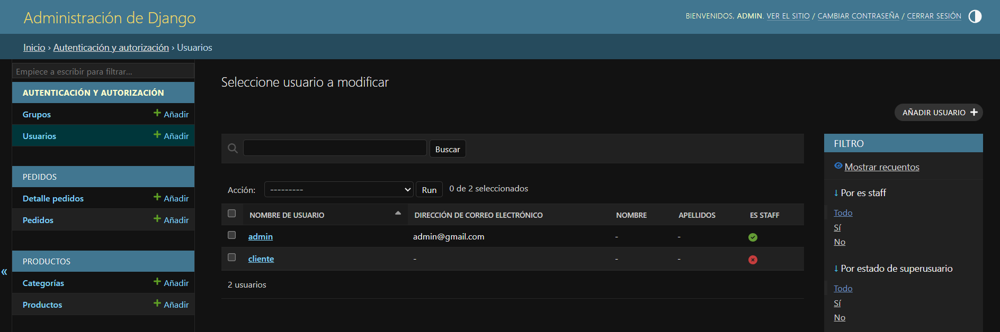

# DESARROLLO DE PORTAFOLIO DE UN PRODUCTO DIGITAL  
## Tabla de contenidos

- [Descripción del proyecto](#descripción-del-proyecto)
- [Tecnologías utilizadas](#tecnologías-utilizadas)
- [Modelo de datos](#modelo-de-datos)
- [Rutas principales](#rutas-principales)
- [Instalación y ejecución](#instalación-y-ejecución)
- [Credenciales de prueba](#credenciales-de-prueba)
- [Evidencias](#evidencias)
- [Estructura del proyecto](#estructura-del-proyecto)
- [Repositorio](#repositorio)
- [Autor](#autor)


## Descripción del proyecto

Entregar la versión final del e-commerce integrando lo desarrollado en módulos anteriores y 
dejándolo listo para portafolio: aplicación ejecutable en local, flujo principal completo, y 
documentación clara en GitHub. 

## Tecnologías utilizadas

- Python 3.14
- Django 6.0.6
- PostgreSQL
- Bootstrap 5
- Bootstrap Icons
- psycopg2-binary
- Pillow
- python-dotenv
- HTML
- CSS
- Git y GitHub


## Modelo de datos

### Categoría

| Campo | Tipo | Descripción |
|---|---|---|
| id | BigAutoField | Identificador automático |
| nombre | CharField | Nombre único de la categoría |
| descripcion | TextField | Descripción opcional |
| disponible | BooleanField | Estado de disponibilidad |

### Producto

| Campo | Tipo | Descripción |
|---|---|---|
| id | BigAutoField | Identificador automático |
| nombre | CharField | Nombre del producto |
| descripcion | TextField | Descripción detallada |
| precio | DecimalField | Precio del producto |
| stock | PositiveIntegerField | Cantidad disponible |
| categoria | ForeignKey | Relación con categoría |
| imagen | ImageField | Imagen del producto |
| disponible | BooleanField | Estado de disponibilidad |
| creado | DateTimeField | Fecha de creación |
| actualizado | DateTimeField | Fecha de actualización |

### Pedido

| Campo | Tipo | Descripción |
|---|---|---|
| id | BigAutoField | Identificador automático |
| usuario | ForeignKey | Usuario que realiza la compra |
| fecha | DateTimeField | Fecha del pedido |
| total | DecimalField | Total final del pedido |

### DetallePedido

| Campo | Tipo | Descripción |
|---|---|---|
| id | BigAutoField | Identificador automático |
| pedido | ForeignKey | Pedido relacionado |
| producto | ForeignKey | Producto comprado |
| cantidad | PositiveIntegerField | Cantidad comprada |
| precio_unitario | DecimalField | Precio al momento de comprar |
| subtotal | DecimalField | Subtotal del producto |

##  Rutas principales
 
### Públicas
 
| Ruta | Descripción |
|---|---|
| `/` | Home |
| `/productos/` | Listado de productos disponibles |
| `/producto/<id>/` | Detalle de un producto |
| `/login/` | Inicio de sesión |
| `/logout/` | Cierre de sesión |
 
### Cliente (autenticado)
 
| Ruta | Descripción |
|---|---|
| `/carrito/` | Ver carrito |
| `/carrito/agregar/<id>/` | Agregar producto al carrito |
| `/carrito/aumentar/<id>/` | Aumentar cantidad |
| `/carrito/disminuir/<id>/` | Disminuir cantidad |
| `/carrito/eliminar/<id>/` | Quitar producto del carrito |
| `/carrito/vaciar/` | Vaciar carrito |
| `/pedido/resumen/` | Resumen previo a confirmar compra |
| `/confirmar/` | Confirmar compra (crea el pedido) |
| `/mis-pedidos/` | Historial de pedidos del usuario |
 
### Administrador (`is_staff`)
 
| Ruta | Descripción |
|---|---|
| `/dashboard/productos/` | Panel de administración de productos |
| `/dashboard/productos/crear/` | Crear producto |
| `/dashboard/productos/editar/<id>/` | Editar producto |
| `/dashboard/productos/eliminar/<id>/` | Eliminar producto |
| `/admin/` | Django Admin nativo |

## Instalación y ejecución

### Prerrequisitos

- Python 3.10 o superior.
- PostgreSQL instalado y en ejecución.
- pip.
- Git.

### 1. Clonar el repositorio

```bash
git clone https://github.com/JCarvajalLab/Modulo-8-E-commerce-ProyectoFinal.git
cd Modulo-8-E-commerce-ProyectoFinal
```
Reemplaza `URL_DEL_REPOSITORIO` y `NOMBRE_DEL_PROYECTO` por los datos reales del repositorio.

### 2. Crear y activar entorno virtual

```bash
python -m venv venv
venv\Scripts\activate
```
### 3. Instalar dependencias

```bash
pip install -r requirements.txt
```

### 4. Crear base de datos PostgreSQL

Ejemplo:

```sql
CREATE USER ecommerce_user
WITH PASSWORD 'ClaveSegura.2026#';

CREATE DATABASE ecommerce_db
OWNER ecommerce_user;

GRANT ALL PRIVILEGES
ON DATABASE ecommerce_db
TO ecommerce_user;

-- nos conectamos a la base de dato "ecommerce_user" y agregamos el siguiente comando

ALTER SCHEMA public OWNER TO ecommerce_user;
```

---
### 5. Crear archivo `.env`

Crea un archivo llamado `.env` en la raíz del proyecto usando `.env.example` como referencia.

Ejemplo:

```PY
SECRET_KEY=colocar_secret_key
DEBUG=True

DB_NAME=ecommerce_db
DB_USER=ecommerce_user
DB_PASSWORD=ClaveSegura.2026#
DB_HOST=localhost
DB_PORT=5432
```

El archivo `.env` no debe subirse a GitHub porque contiene información sensible.

---

### 6. Aplicar migraciones

```bash
python manage.py makemigrations
python manage.py migrate
```
---
### 7. Crear usuarios de prueba

Ejecuta este script para crear automáticamente un usuario administrador
y un usuario cliente (si ya existen, el script solo lo indica y no hace nada):

```bash
python crear_usuarios.py
```

Esto crea:
- `admin` / `Admin12345!` → superusuario, con acceso al panel de productos y a Django Admin.
- `cliente` / `Cliente12345!` → usuario normal, con acceso al catálogo, carrito y pedidos.
---
### 8. Ejecutar servidor local

```bash
python manage.py runserver
```

Luego abrir:

```text
http://127.0.0.1:8000/
```

---

## Credenciales de prueba

### Administrador

| Campo | Valor |
|---|---|
| Usuario | `admin` |
| Contraseña | `Admin12345!` |
| Acceso | Panel de productos y Django Admin |

### Cliente

| Campo | Valor |
|---|---|
| Usuario | `cliente` |
| Contraseña | `Cliente12345!` |
| Acceso | Catálogo, carrito, compra e historial de pedidos |

> Estas credenciales son solo para fines de prueba y demostración local.

---

## Evidencias

Las capturas deben guardarse dentro de una carpeta llamada:

### Home



### Catálogo de productos



### Detalle de producto



### Carrito de compras



### Resumen de pedido



### Historial de pedidos



### Panel de productos



### Formulario de producto




### Panel de administrador Django
---


## Estructura del proyecto

```
└── 📁ecommerce_portafolio
    └── 📁carrito
        └── 📁migrations
            ├── __init__.py
        └── 📁templates
            └── 📁carrito
                ├── ver_carrito.html
        ├── __init__.py
        ├── admin.py
        ├── apps.py
        ├── carrito.py
        ├── models.py
        ├── tests.py
        ├── urls.py
        ├── views.py
    └── 📁config
        ├── __init__.py
        ├── asgi.py
        ├── settings.py
        ├── urls.py
        ├── wsgi.py
    └── 📁media
        └── 📁productos
    └── 📁pedidos
        └── 📁migrations
            ├── __init__.py
            ├── 0001_initial.py
        └── 📁templates
            └── 📁pedidos
                ├── confirmar_pedido.html
                ├── mis_pedidos.html
        ├── __init__.py
        ├── admin.py
        ├── apps.py
        ├── models.py
        ├── tests.py
        ├── urls.py
        ├── views.py
    └── 📁productos
        └── 📁migrations
            ├── __init__.py
            ├── 0001_initial.py
            ├── 0002_producto.py
            ├── 0003_rename_categoria_producto_categoria.py
        └── 📁static
            └── 📁productos
                └── 📁css
                └── 📁images
                └── 📁js
        └── 📁templates
            └── 📁productos
                ├── confirmar_eliminar.html
                ├── detalle_producto.html
                ├── formulario_producto.html
                ├── home.html
                ├── lista_productos.html
                ├── panel_productos.html
        ├── __init__.py
        ├── admin.py
        ├── apps.py
        ├── forms.py
        ├── models.py
        ├── tests.py
        ├── urls.py
        ├── views.py
    └── 📁static
        └── 📁css
            ├── style.css
        └── 📁images
        └── 📁js
    └── 📁templates
        └── 📁includes
            ├── footer.html
            ├── navbar.html
        ├── base.html
    └── 📁usuarios
        └── 📁migrations
            ├── __init__.py
        └── 📁templates
            └── 📁usuarios
                ├── login.html
        ├── __init__.py
        ├── admin.py
        ├── apps.py
        ├── forms.py
        ├── models.py
        ├── tests.py
        ├── urls.py
        ├── views.py
    ├── .env
    ├── .env.example
    ├── .gitignore
    ├── manage.py
    ├── pasos.md
    ├── README.md
    └── requirements.txt
```

---

## Repositorio

🔗 [https://github.com/JCarvajalLab/Modulo-8-E-commerce-ProyectoFinal](https://github.com/JCarvajalLab/Modulo-8-E-commerce-ProyectoFinal)
---

## Autor

**Actividad Final - Modulo 8 - Desarrollo Portafolio**

**Alumno:** Jordan Carvajal - **Fecha:** 04-07-2026